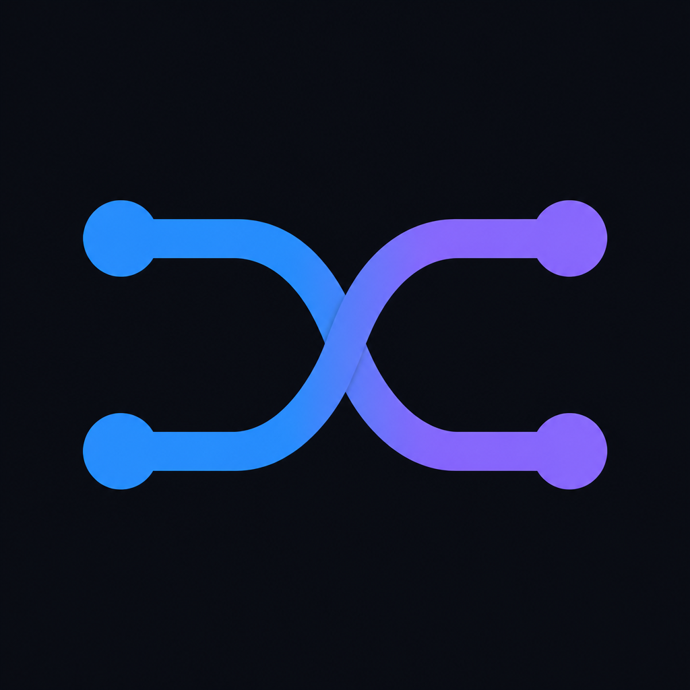

<p align="center">
  
</p>

<h1 align="center">InfluenceFlow CRM</h1>

<p align="center">
  <strong>Open-source influencer marketing CRM</strong> for agencies and freelancers.<br />
  Creators · brands · outreach · campaigns · calendar — in one private web workspace.<br />
  Next: discover creators &amp; sponsoring brands by the filters you actually use.
</p>

<p align="center">
  <a href="https://dhurimhalili.github.io/influenceflow-crm/#/app">Live app</a> ·
  <a href="https://dhurimhalili.github.io/influenceflow-crm/home.html">About</a> ·
  <a href="https://dhurimhalili.github.io/influenceflow-crm/#/signup">Sign up free</a> ·
  <a href="#roadmap--discovery--matching">Roadmap</a>
</p>

<p align="center">
  
  
  
</p>

---

## Why this exists

Agencies still run influencer work across **Notion + spreadsheets + Gmail + DMs**. That stack is flexible — and terrible for deals.

InfluenceFlow is purpose-built for the workflow:

| Pain today | InfluenceFlow |
|------------|----------------|
| Creators buried in spreadsheets | Creators CRM + kanban + statuses |
| Brands & contacts in another doc | Brands + people in the same workspace |
| Outreach copy pasted into Gmail | Templates → personalize → send via **your** Gmail |
| Campaigns conflict / get forgotten | Campaigns + calendar + reminders |
| Finding *new* creators is manual | **Roadmap:** filter-based creator & brand discovery |

Not another closed SaaS marketplace. **MIT-licensed**, private per-user workspaces (Supabase Auth + RLS), web-first and built to self-host.

---

## Live demo

- **App:** [dhurimhalili.github.io/influenceflow-crm/#/app](https://dhurimhalili.github.io/influenceflow-crm/#/app)
- **Sign up:** [Create a free account](https://dhurimhalili.github.io/influenceflow-crm/#/signup)
- **Marketing page:** [home.html](https://dhurimhalili.github.io/influenceflow-crm/home.html)

Each account gets an isolated workspace — other users cannot see your data.

---

## What's shipped today

| Area | What you get |
|------|----------------|
| **Auth** | Signup / login · private data per account (Supabase Auth + RLS) |
| **Creators** | Table + kanban · notes · pipeline statuses · soft archive · duplicate merge |
| **Brands** | Brand list + brand people (name, title, email) |
| **Outreach** | New / reach-back / mixed · templates · review/customize · Gmail cloud send |
| **Campaigns** | Deal tracking with conflict warnings |
| **Calendar** | Meetings + browser reminders |
| **Data** | Global search · CSV/JSON export |
| **UI** | Dark (default) / light · mobile/tablet · PWA |

### Stack

- **Frontend:** React 19 · TypeScript · Vite · React Router
- **Backend:** Supabase (Postgres + Auth + RLS)
- **Email:** Gmail OAuth via Edge Functions (`gmail-oauth-start`, `send-emails`)

---

## Creator Discovery — automated, free, runs itself

The **Discovery** page in the app runs a YouTube influencer search on a schedule and writes
the shortlist straight into your `creators` table. No PC needed — it runs on Supabase's servers.

**How it stays free and quota-safe**

| Mechanism | What it does |
|---|---|
| 5 API keys (`YOUTUBE_API_KEYS`) | Rotates across keys; a 403 (quota hit) on one key switches to the next |
| Keyword rotation | Each run searches only `max_keywords_per_run` keywords from your pool, cycling daily — never the whole list at once |
| 7-day cooldown (`searched_channels`) | A channel is evaluated **once**; it's skipped for `cooldown_days` even if it keeps appearing in searches |
| Cheap-first pipeline | Subscriber-band filter **before** any video enrichment; channel/video lookups are batched (≤50 IDs per 1-unit call) |
| Cron tick | pg_cron fires every 5 min; the function only runs a user's search at *their* chosen time/timezone, once per day |

**Setup (one time)**

1. **If the app shows "Loading…" forever**, your free Supabase project is probably **paused**
   (free projects pause after ~1 week of inactivity). Restore it:
   Supabase Dashboard → your project → **Restore project**. The daily scheduled run counts as
   activity, so once the cron is live it should not pause again.
2. Apply [`supabase/migrations/20260823000000_creator_discovery.sql`](supabase/migrations/20260823000000_creator_discovery.sql)
   in the Supabase SQL Editor (creates the settings / cooldown / run-log tables + RLS).
3. Set secrets and deploy the function:
   ```powershell
   supabase secrets set YOUTUBE_API_KEYS=key1,key2,key3,key4,key5 DISCOVERY_SECRET=some-long-random-string
   supabase functions deploy discover-creators
   ```
4. Enable the `pg_cron` and `pg_net` extensions, then add the 5-minute tick from the bottom of
   the migration file (fill in your project URL, anon key, and `DISCOVERY_SECRET`).
5. Open **Discovery** in the app: paste your keywords + negatives, pick your **time and
   timezone**, toggle auto-run on/off, and use **Run now** for an immediate search.
   A manual run never cancels the scheduled one.

---

## Roadmap — discovery + matching

The CRM manages people you **already know**. The next layer finds the people you **need**.

### 1. Creator discovery

Search / scrape influencers by agency-grade filters, for example:

- Language (e.g. English)
- Gender / niche
- Avg views · engagement rate · subscribers / followers band
- Platform (YouTube, Instagram, TikTok, …)

**Example query:** English · male · ~50k avg views · ~1% engagement · ~50k subscribers → shortlist → one-click **add to CRM**.

### 2. Brand discovery

Find brands that already sponsor creators in that same profile band — so outreach isn’t cold guessing.

### 3. Match → CRM → outreach → campaign

One loop:

```text
filters → creators + sponsoring brands → InfluenceFlow CRM → Gmail outreach → campaign
```

That’s the open layer the ecosystem is missing: not “another Notion template,” and not a locked marketplace — **discover → manage → close** in one web app.

> Status: CRM core is **live**. Discovery & matching are **in active design / build**. Track progress in [Issues](https://github.com/DhurimHalili/influenceflow-crm/issues).

---

## Quick start (local)

```powershell
cd web
copy .env.example .env
# set VITE_SUPABASE_URL and VITE_SUPABASE_ANON_KEY
npm install
npm run dev
```

Open the URL Vite prints (usually http://localhost:5173).

### Supabase

Apply SQL under [`supabase/migrations/`](supabase/migrations/). Edge Function secrets:

- `GOOGLE_CLIENT_ID`
- `GOOGLE_CLIENT_SECRET`
- `GMAIL_OAUTH_REDIRECT_URI`

Public `privacy.html` / `terms.html` support Google OAuth branding verification.

### Deploy (GitHub Pages)

From `web/`:

```powershell
npm run deploy:pages
```

---

## Project layout

```text
influenceflow-crm/
├── web/                 ← Vite + React app (source of truth)
├── supabase/            ← migrations + Edge Function notes
├── home.html            ← public about page (also under web/public)
├── privacy.html         ← Privacy Policy
├── terms.html           ← Terms of Service
├── LICENSE              ← MIT
└── README.md
```

---

## Contributing

See [CONTRIBUTING.md](CONTRIBUTING.md). Ideas, bugs, and PRs welcome — especially around discovery filters, ranking, and docs.

---

## License

[MIT](LICENSE) © Dhurim Halili

---

## Contact

- Portfolio: [concepts-ew8.pages.dev](https://concepts-ew8.pages.dev/)
- LinkedIn: [dhurim-halili](https://www.linkedin.com/in/dhurim-halili-9183b81a0/)
- WhatsApp: [+383 49 878 908](https://wa.me/38349878908)
